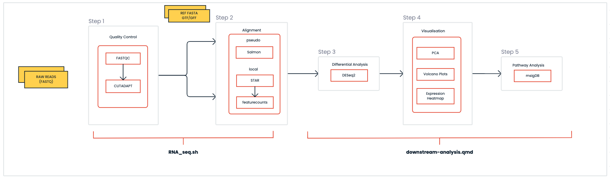

# RNA-seq analysis:

This repo contains the scripts used for analysis of the Bulk-RNA sequencing analysis. 

## PIPELINE FLOWCHART:



## STEPS:
- Pre-processing:
    - Quality Control using FASTQC tool
- Alignment:
    - Salmon : pseudo quantification
    - STAR   : local alignment 
        - feature counts : to count the reads per sample
- Differential Analysis:
    - Filtering low confidence reads
    - Differential gene expression using deseq2
- Visualization :
    - PCA
    - Volcano Plots
    - Heatmap
- Pathway Analysis : 
    - msigDB 

## CONDA ENVIRONMENT:
- Create a new conda environment and installing tools needed for RNA_seq.sh script
```
conda create -f conda_envs/RNA_seq.yml
conda activate RNA_seq
```

## HOW TO RUN THE PIPELINE:
- INPUT PATHS:
    - FASTQ_DIR   =</path/of/the/directory/containing/fastq/files>
    - REF_DIR     =</path/of/the/directory/containing/reference/indexes>
    - RESULTS_DIR =</path/of/the/directory/to/store/results>

- PARAMETER:
    - SPECIES     = "mm10" or "hg38"
    - ALIGNER     = "salmon" or "STAR"
    - READS       = "single" or "paired"

- Command:
    - bash RNA_seq <FASTQ_DIR> <REF_DIR> <RESULTS_DIR> <species> <aligner> <reads>
    - Example: 
    ```
    bash RNA_seq.sh /test/fastq_files /test/mm10_salmon /test/results "mm10" "salmon" "paired"
    ```

- OUTPUT FOLDER:
    - fastQC                : quality control reports for all the fastq files
    - salmon/STAR           : quant or bam files

## DOWNSTREAM ANALYSIS:
- downstream-analysis.qmd : 
    - differential gene expression analysis 
    - Visualization plots 
    - Pathway analysis
